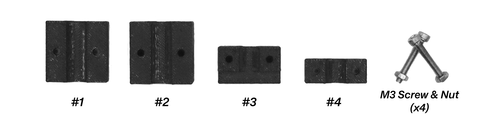

# Printable Apex Edge Pro attachments 

## Spyderco Triangle Hone Holder

As entitled, the attachments allows using triangle-shaped hones (for instance, Spyderco Triangle stones) with Apex & Apex Pro models, allowing sharpening serrations and recurve blades.

### Required tools
- ***M3 Allen Key*** 
- ***Soldering Iron*** can be used to melt nuts into plastic

### Prerequisites 

- ***M3 Allen Key*** 

|Item| Quantity |
|--|--|
|[1](./spyderco_triangle_adapter/1-Body.3mf) | 1 |
|[2](./spyderco_triangle_adapter/2-Body.3mf)  | 1 |
|[3](./spyderco_triangle_adapter/3-Body.3mf)  | 1 |
|[4](./spyderco_triangle_adapter/4-Body.3mf)  | 1 |
|M3x20 Cap Head Screw  | 4 |
|M3x20 Hex Nut  | 4 |

There is some space left in the part models so both screws and nuts fit inside sockets. However, one can increase thickness a bit for better hone fixation, but additional drilling and melting will be required.
